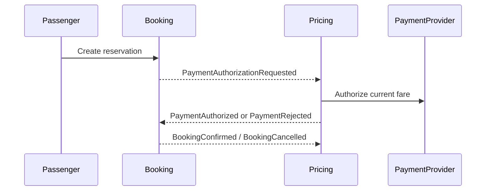

# ShareWay Booking & Pricing

Backend microservice for booking shared trips, reserving seats with optimistic locking, managing pricing rules, and estimating fares. `booking` and `pricing` are independent bounded contexts and communicate only through identifiers.

## Requirements

- Java 25
- Maven Wrapper
- PostgreSQL on `localhost:5432`
- Development database `shareway-booking-pricing`

Set `DB_PASSWORD` and `JWT_SECRET` in IntelliJ under **Run Configuration -> Environment variables**. `JWT_SECRET` must contain at least 32 bytes. The supported variables are `DB_URL`, `DB_USER`, `DB_PASSWORD`, `JWT_SECRET`, and `PRICING_PLATFORM_FEE_PERCENT`; `.env.example` contains safe placeholders.

The application uses Flyway migrations and `spring.jpa.hibernate.ddl-auto=validate`. On an empty database, startup applies migrations V1 through V5. `trip_groups.departure_at`, `zone`, and `estimated_distance_km` are provisional values until Driver Operations & Routing supplies them.

For integration tests, install and start Docker Desktop, then run `./mvnw -q verify`; Testcontainers starts an isolated PostgreSQL container and does not use the development database. On Windows, Docker Desktop must be running before launching Maven.

As an optional alternative, the `local-test` profile points only to the separate `shareway-booking-pricing-test` database:

```powershell
$env:DB_TEST_PASSWORD = "your-local-test-password"
$env:JWT_SECRET = "your-development-secret-with-at-least-32-bytes"
./mvnw.cmd -q spring-boot:run "-Dspring-boot.run.profiles=local-test"
```

Create that database separately before use. Never set `DB_TEST_URL` or `DB_URL` to `shareway-booking-pricing` when using this profile.

## Local database reset

`docs/db/reset-local.sql` is a manual development-only operation. Before running it, verify that the connection is exactly `jdbc:postgresql://localhost:5432/shareway-booking-pricing`. It drops and recreates only the `public` schema:

```bash
psql -h localhost -p 5432 -U postgres -d shareway-booking-pricing \
  -f docs/db/reset-local.sql
```

The same script can be run from an IntelliJ PostgreSQL console. It is never executed automatically by the application.

## API

- `POST /api/v1/bookings` creates a booking and returns `201 Created` with `Location`.
- `GET /api/v1/bookings/{bookingId}` retrieves a booking without exposing hashes.
- `POST /api/v1/bookings/{bookingId}/cancel` cancels a booking and releases its seat.
- `POST /api/v1/pricing/fare-rules` creates a fare rule.
- `GET /api/v1/pricing/fare-rules?zone=` lists rules, optionally filtered by zone.
- `GET /api/v1/pricing/fare-rules/{id}` retrieves a rule.
- `PUT /api/v1/pricing/fare-rules/{id}` updates a rule.
- `GET /api/v1/pricing/fares/estimate?zone=&date=&distanceKm=&passengers=` calculates a fare.
- `POST /api/v1/pricing/payments` authorizes a payment using the current group fare.
- `GET /api/v1/pricing/payments/{paymentId}` retrieves a payment.
- Swagger UI: `/swagger-ui.html`
- OpenAPI document: `/v3/api-docs`

Authenticated endpoints require a JWT with `sub` as UUID and a `role` claim (`passenger`, `driver`, or `admin`). Fare-rule management is restricted to administrators; booking creation requires a passenger; fare estimates require any authenticated role.

## Saga flow



Events currently use in-memory Spring publication. They are lost if the application stops during processing; a durable Event Bus with retries and an Outbox is pending.

## Tests

Run the verification suite with:

```bash
./mvnw -q verify
```

Domain events currently use in-memory Spring publication and are lost if the application stops during processing. A durable event bus with retries and an Outbox remains future work. Saga orchestration, Circuit Breaker, notification delivery, and payment REST integration remain pending.
